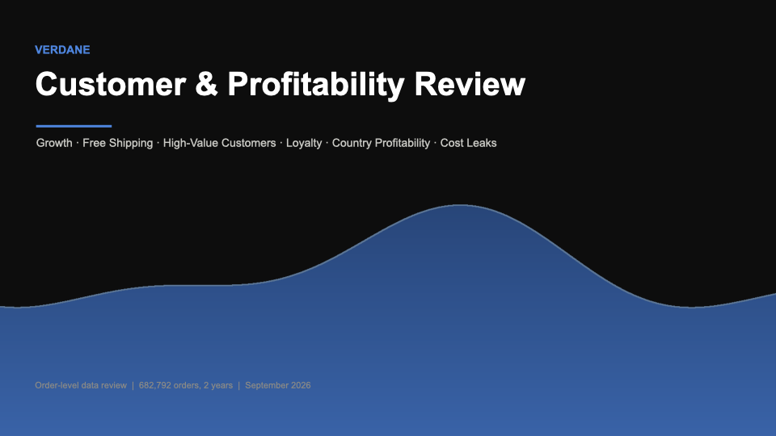
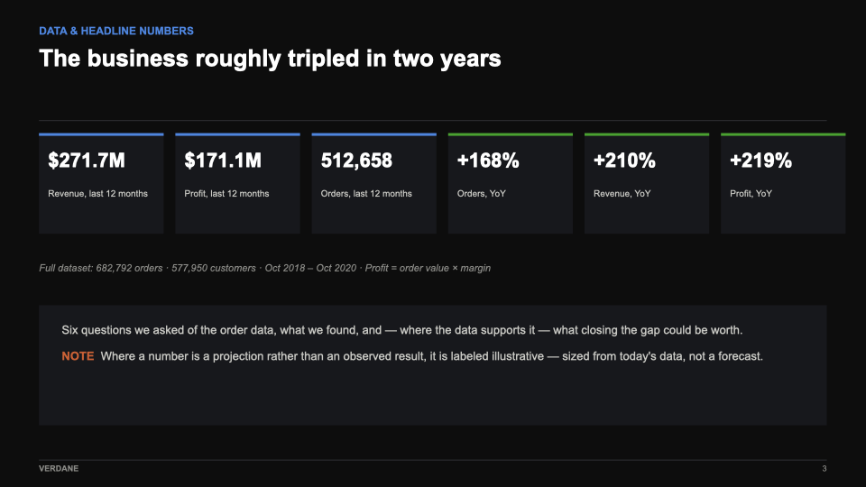
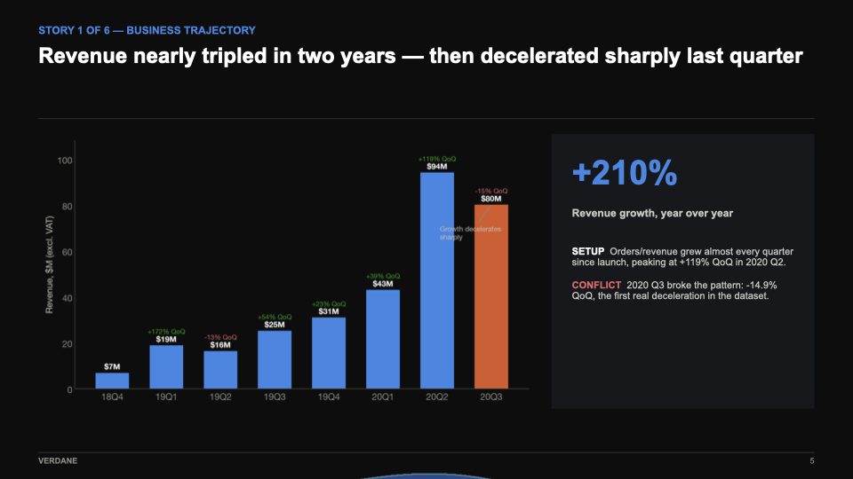
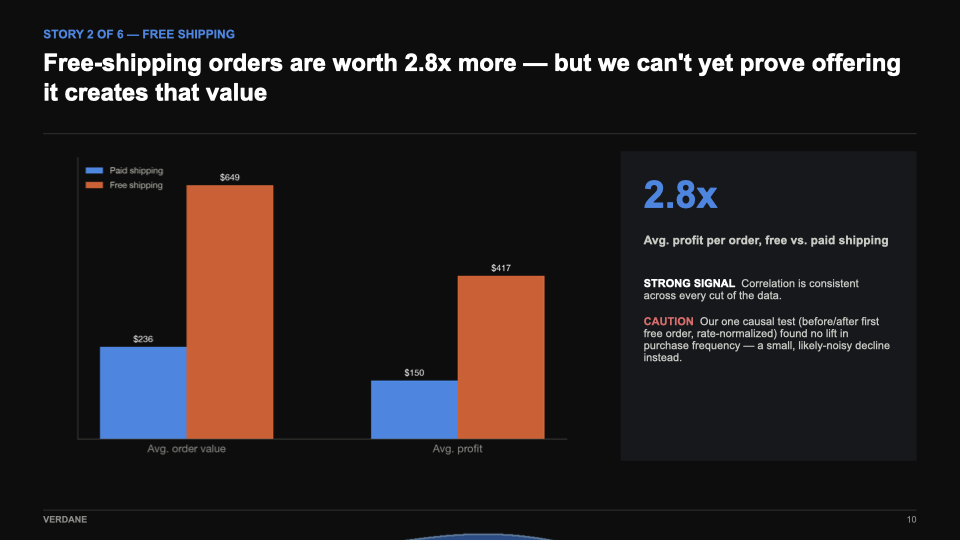
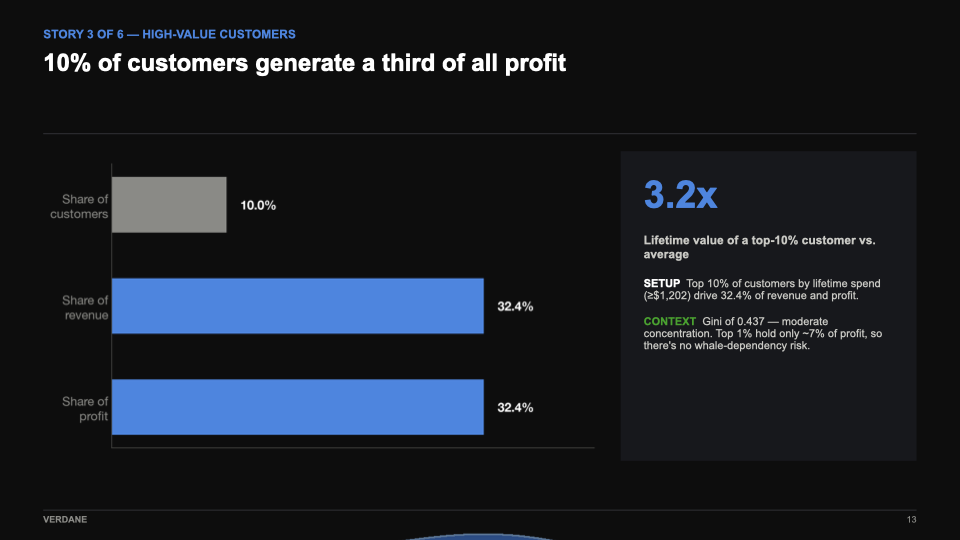
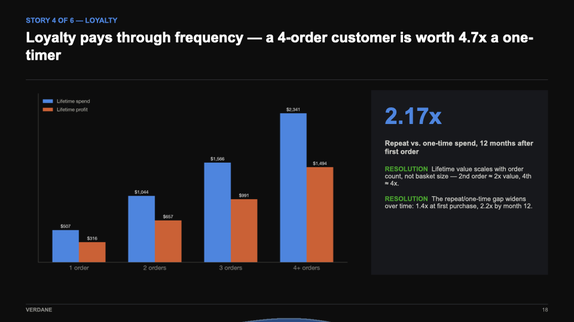
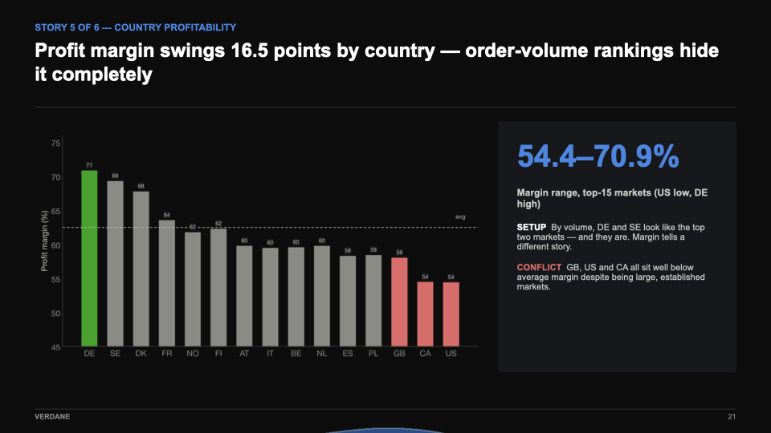
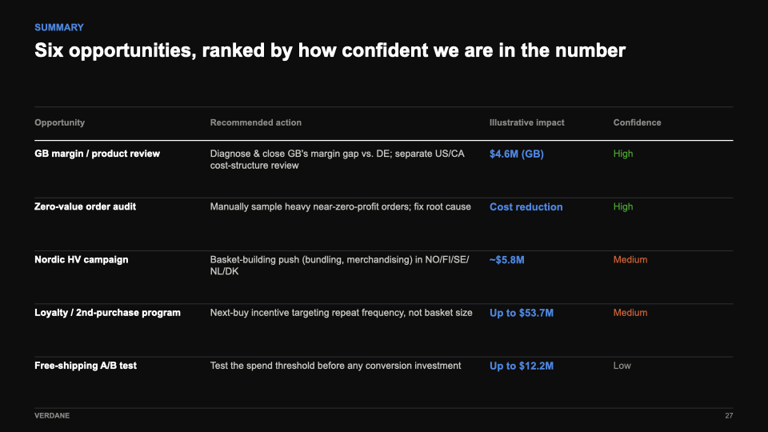

# Verdane EDA Case: Customer & Profitability Review

An exploratory data analysis case study for **Verdane**. Two years of order-level e-commerce data
(682,792 orders, 577,950 customers, Oct 2018 – Oct 2020) analysed with the **PPDAC** cycle
(Problem, Plan, Data, Analysis, Conclusion). The findings are presented in a 31-slide deck for a C-level meeting.

## Key findings

| # | Question | Finding |
|---|---|---|
| 1 | **Business trajectory**: are we still growing? | Revenue grew **+210% year over year**, but the latest quarter slowed sharply (QoQ −14.9%). Newer customers are *more* loyal, so the slowdown isn't a warning sign. |
| 2 | **Free shipping**: is the perk eating profit? | Free-shipping orders are worth **2.8×** more in profit, but the data can't prove the offer causes it, so we recommend an A/B test first. |
| 3 | **High-value customers**: who are our best customers? | The top **10% of customers generate a third of all profit**. High-value rates don't follow GDP: the Nordics under-perform. |
| 4 | **Loyalty**: why do so few customers come back? | Only **14.2%** of customers place a second order. Loyalty pays through *frequency*, not bigger baskets: a 4-order customer is worth **4.7×** a one-timer. |
| 5 | **Country profitability**: which markets need fixing? | Margin swings **16.5 points** between markets (US 54.4% → DE 70.9%), hidden by order-volume rankings. |
| 6 | **Order-level cost leaks**: are any orders losing money? | No loss-making orders, but a heavy near-zero-value cluster worth auditing. |

Ranked by confidence, the six opportunities add up to several million in illustrative profit uplift.
Every number that is a projection rather than an observation is labeled as such in the deck, with the scenario math in the appendix.

## Slides

| | |
|---|---|
|  |  |
|  |  |
|  |  |

The full deck is [`Verdane_Insights_Presentation.pptx`](Verdane_Insights_Presentation.pptx).

## Repository contents

| File | What it is |
|---|---|
| `EDA Case.pdf` | The case brief |
| `orders_eda.ipynb` | First look at the data: orders, revenue and profit over time, shipping weight vs. cost |
| `Q1_free_shipping_analysis.ipynb` | Does free shipping make customers spend more? |
| `Q1.1_free_shipping_customer_impact.ipynb` | Customers who convert from paid to free shipping |
| `Q2_high_value_customers.ipynb` | The top 10% of customers: where they are, what they buy, GDP vs. high-value rate |
| `Q3_profit_concentration.ipynb` | How concentrated profit is across customers |
| `Q4_loyal_customers.ipynb` | Repeat customers and how their value grows over time |
| `Q5_business_trajectory.ipynb` | Growth WoW / QoQ / YoY, cohorts and seasonality |
| `Q6_country_profitability.ipynb` | Margin and profit per order by country |
| `Q7_loss_making_orders.ipynb` | Negative and near-zero-profit orders |
| `Verdane_Insights_Presentation.pptx` | The C-level presentation |
| `good_insights.txt`, `discovery.txt` | Working notes in the PPDAC format |
| `Presentation_Directives.txt` | Brief used to build the deck |

## Running the notebooks

> **Note:** the dataset (`orders.csv`) was provided by Verdane for this case and is **not included**
> in this repository. The notebooks keep their saved outputs, so the analysis and charts are fully
> visible without it; re-running them requires the original data file placed in the repo root.

The notebooks use Python with `pandas`, `numpy` and `matplotlib`.

## The case brief

> Find interesting insights in the data that provide value to the stakeholders, and visualize and communicate
> them clearly. Follow the PPDAC cycle when analyzing and visualizing the data. When you find an insight in a
> plot, write down key words following the setup–conflict–resolution framework.
>
> Example questions: How has the business been performing over time? Which countries are the biggest and most
> profitable markets? Is there a time of day when sales are bigger? What is the cost of shipping compared to sales?
>
> Don't get stuck on small details that won't bring insights. Ask instead: *can this insight lead to the company
> taking an action that increases sales, increases profitability or decreases cost?*
